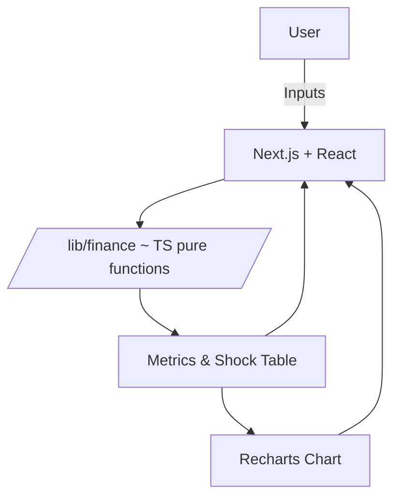
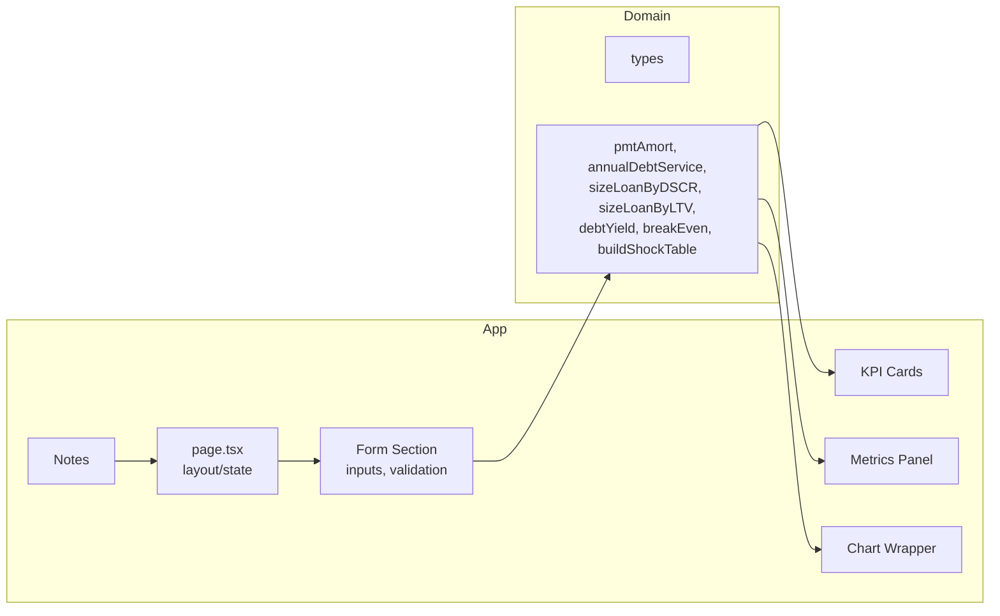
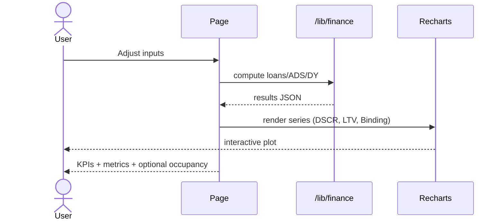

# DSCR / Refi Stress-Tester (v1)

A professional, one-page web app for real-estate loan sizing and stress-testing. Instantly size loans by DSCR and LTV, report Debt Yield and Year-1 ADS, and visualize a rate-shock curve. Built with Next.js, TypeScript, Tailwind, shadcn/ui, and Recharts.

---

## Features
- Deterministic, pure finance logic (DSCR, LTV, Debt Yield, ADS)
- Real-time, interactive UI with grouped inputs and validation
- KPI cards for Max Loan @ DSCR, Max Loan @ LTV, Binding Loan, Debt Yield
- Metrics panel for evaluated loan, Year-1 ADS, DSCR at loan
- Rate-shock curve chart (±200bps) with three series (DSCR, LTV, Binding)
- Clean, accessible, and responsive design
- No backend, no persistence—just pure calculation

## Why It Matters
Demonstrates real-estate underwriting literacy and coding skill. Useful for deal-screening, credit discipline, and education.

## Tech Stack
- Next.js (App Router), React 18, TypeScript
- Tailwind CSS, shadcn/ui, Recharts
- pnpm, ESLint, Prettier, Vitest
- Vercel (deploy-ready)

## Finance Equations
- **Monthly Rate:** `r_m = r_annual / 12`
- **Amortizing PMT:**
	- If `r_m == 0`: `PMT = principal / n`
	- Else: `PMT = principal * r_m / (1 - (1 + r_m)^(-n))`
- **Year-1 ADS:**
	- If `IO_years > 0`: `ADS = 12 * principal * r_m`
	- Else: `ADS = 12 * PMT`
- **DSCR:** `DSCR = NOI / ADS`
- **Size by DSCR:**
	- If `IO_years > 0 && r_m > 0`: `PV_DSCR = NOI / (target_DSCR * 12 * r_m)`
	- Else:
		- `monthly_cap = NOI / (target_DSCR * 12)`
		- If `r_m == 0`: `PV_DSCR = monthly_cap * n`
		- Else: `PV_DSCR = monthly_cap * (1 - (1 + r_m)^(-n)) / r_m`
- **Size by LTV:** `PV_LTV = LTV_max * Value`
- **Binding Loan:** `Loan_binding = min(PV_DSCR, PV_LTV)`
- **Debt Yield:** `DY = NOI / Loan`
- **Break-even Occ (optional):** `occ_BE = (ADS + Fixed_expenses) / (PGI * (1 - var_exp_ratio))` (clamped to [0, 1])

## Architecture Diagrams

### System Context


### Component Diagram


### Sequence Diagram



## Getting Started

### 1. Clone and Install

```sh
git clone https://github.com/yourusername/dscr-refi-ts.git
cd dscr-refi-ts
pnpm install
```

### 2. Run Locally

```sh
pnpm dev
```
Open [http://localhost:3000](http://localhost:3000) in your browser.

### 3. Run Tests

```sh
pnpm test
```

### 4. Build for Production

```sh
pnpm build
```

### 5. Deploy

- Push to GitHub, connect to Vercel, deploy with one click.

---

## Implementation Overview

This project is a single-page, deterministic, and testable web app for real-estate loan sizing and stress-testing. It is organized as follows:

- **/app**: Next.js App Router, main page, and UI components (inputs, KPIs, chart)
- **/lib/finance**: Pure TypeScript finance logic (DSCR, LTV, Debt Yield, ADS, shock table)
- **/lib/types**: Canonical interfaces and type guards
- **/tests**: Vitest unit tests for all finance logic
- **/public**: Static assets and screenshots

All calculations are pure functions, and the UI is fully controlled and accessible. The chart is powered by Recharts, and the UI uses Tailwind CSS and shadcn/ui for a modern, finance-appropriate look.

---

## Project Structure

```
dscr-refi-ts/
├─ app/                 # Next.js App Router
│  ├─ page.tsx         # main screen
│  └─ components/      # KPI cards, forms, chart wrappers
├─ lib/
│  ├─ finance/         # core.ts (pure math), formatters
│  └─ types/           # interfaces
├─ tests/              # vitest unit tests for finance
├─ public/             # screenshots for README
├─ package.json        # scripts (dev, test, lint, build)
├─ tailwind.config.ts
├─ tsconfig.json
└─ README.md
```

## Screenshot


> **Note:** The above image is a placeholder. Once the UI is finalized, replace `public/screenshot.png` with a real screenshot of the app. This placeholder ensures documentation and deployment readiness as required by the implementation plan (TASK-031).

## References
- [Project Guide](./dsci-refi/guide.md)
- [How-to Guide](./dsci-refi/HOWTO.md)
- [Next.js Docs](https://nextjs.org/docs)
- [Tailwind CSS Guide](https://tailwindcss.com/docs/guides/nextjs)
- [shadcn/ui](https://ui.shadcn.com/)
- [Recharts](https://recharts.org/en-US)
- [Vitest](https://vitest.dev/)
- [Vercel](https://vercel.com/)
